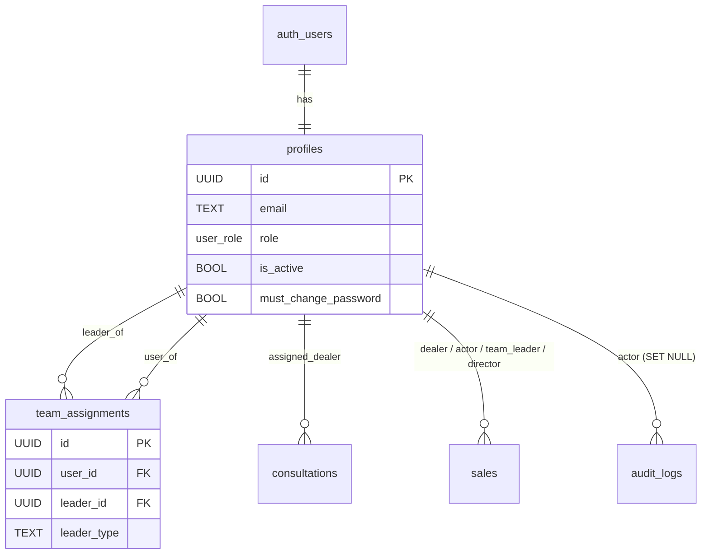
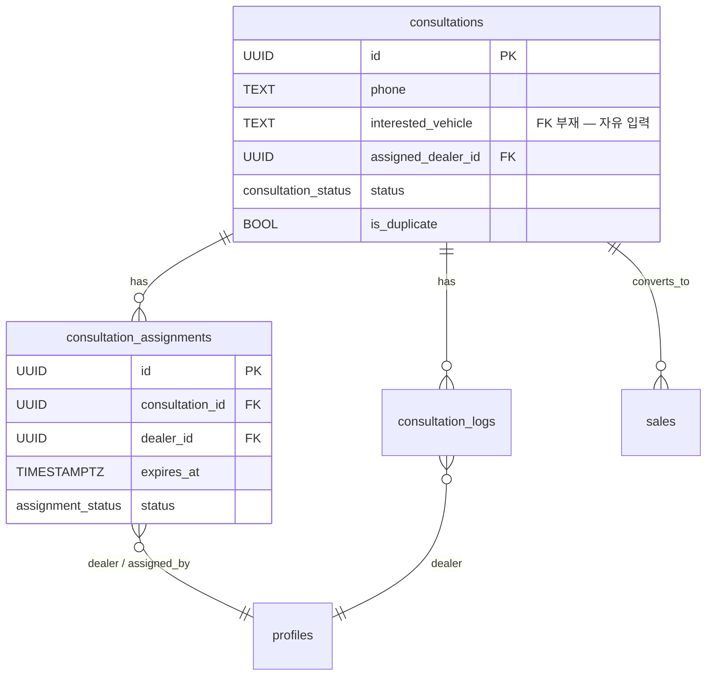
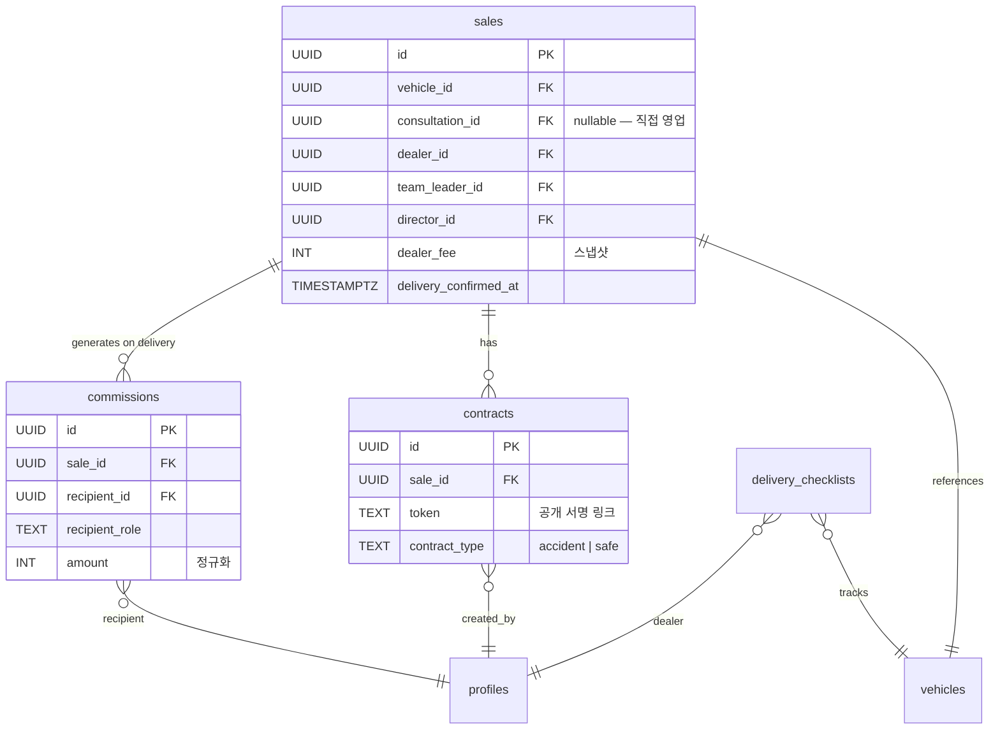
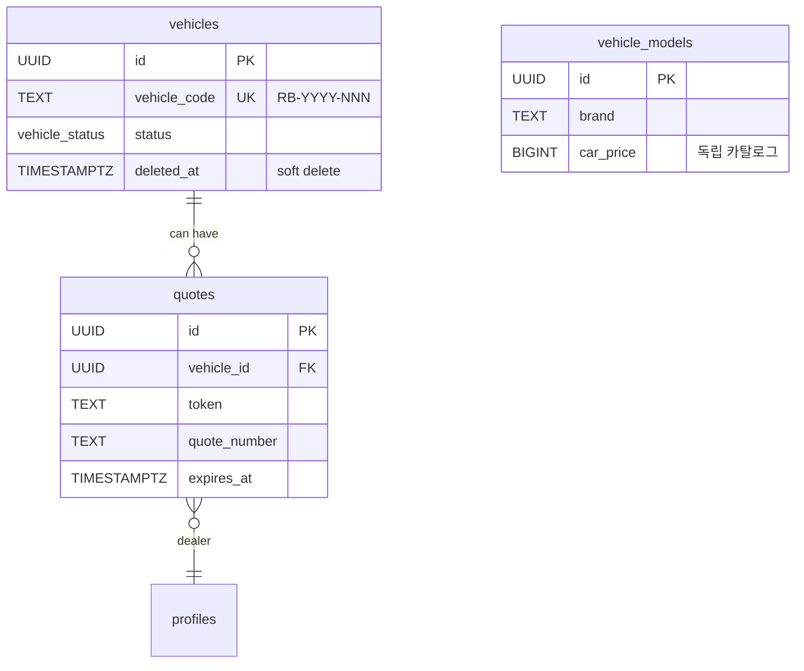

# 리본랩스 DB 스키마 전수 감사 보고서

> 기준: Supabase 공식 `supabase-postgres-best-practices` 스킬 v1.1.1 (8 카테고리)
> 작성일: 2026-05-07
> 범위: `supabase/migrations/` 29개 파일 + `types/database.ts` + RPC 호출 라우트

---

## 0. TL;DR

| 항목 | 평가 |
|------|------|
| **스키마 설계 점수** | 8.2 / 10 |
| **운영 안정성** | 7.8 / 10 |
| **즉시 조치 필요(P1)** | 3건 |
| **단기 개선(P2)** | 3건 |
| **중장기 개선(P3-P4)** | 6건 |

**강점**: RLS 계층 설계 명확, FK 인덱스 핫픽스 적용 완료(`20260429_missing_fk_indexes`), SECURITY DEFINER `search_path` 일괄 적용 완료(`20260429_security_definer_search_path`), 동시성 제어(`SELECT FOR UPDATE`, advisory lock) 우수.

**약점**: ENUM 정합성 미흡(SQL ↔ TS 수동 동기화), 소프트 삭제 컨벤션 불일치(`deleted_at` vs `cancelled_at` vs `status`), `consultations.vehicle_id` FK 부재(자유 입력 텍스트만).

---

## 1. 테이블 카탈로그 (17개)

### 1-1. 사용자 / 조직 도메인

| # | 테이블 | 핵심 컬럼 | FK | 인덱스 | 도입 |
|---|--------|----------|----|--------|------|
| 1 | `profiles` | id(PK), email, name, role, is_active, must_change_password | auth.users(id) | role, is_active | 001 |
| 2 | `team_assignments` | id, user_id, leader_id, leader_type | profiles×2 | user, leader, (user,leader_type) UNIQUE | 20260420_org |

### 1-2. 상담 / 배정 도메인

| # | 테이블 | 핵심 컬럼 | FK | 인덱스 | 도입 |
|---|--------|----------|----|--------|------|
| 3 | `consultations` | id, customer_name, phone, interested_vehicle, assigned_dealer_id, status, is_duplicate, available_deposit, desired_monthly_payment, utm_* | profiles(assigned_dealer_id) | status, assigned_dealer_id, created_at, phone, source | 001 → 20260422_apply_utm |
| 4 | `consultation_logs` | id, consultation_id, dealer_id, content, status_snapshot | consultations, profiles | consultation_id, dealer_id | 001 |
| 5 | `consultation_assignments` | id, consultation_id, dealer_id, assigned_by, expires_at, status | consultations, profiles×2 | (expires_at WHERE status=pending), (consultation_id, time DESC) | 009 |

### 1-3. 차량 / 견적 도메인

| # | 테이블 | 핵심 컬럼 | FK | 인덱스 | 도입 |
|---|--------|----------|----|--------|------|
| 6 | `vehicles` | id, vehicle_code(UNIQUE), make, model, year, status, photos, deleted_at | — | status, deleted_at, (status, deleted_at), GiST(trgm) | 001 → 20260429_vehicles_search_trgm |
| 7 | `vehicle_models` | id, brand, model, trim, car_price, monthly_payment, max_deposit, display_order, is_active | — | (brand WHERE is_active), display_order | 20260421_vehicle_models |
| 8 | `quotes` | id, vehicle_id, dealer_id, token, quote_number, expires_at, view_count, first/last_viewed_at | vehicles, profiles | token, vehicle_id, dealer_id | 20260420_quotes |

### 1-4. 판매 / 계약 / 정산 도메인

| # | 테이블 | 핵심 컬럼 | FK | 인덱스 | 도입 |
|---|--------|----------|----|--------|------|
| 9 | `sales` | id, consultation_id, vehicle_id, dealer_id, actor_id, dealer_fee, marketing_fee, cancelled_at, team_leader_id, team_leader_fee, director_id, director_fee, delivery_confirmed_at | vehicles, profiles×4 | dealer_id, vehicle_id, cancelled_at, team_leader, director, delivery_confirmed_at | 001 → 20260420 → 20260423 |
| 10 | `contracts` | id, sale_id, token, status, customer_*, vehicle_info, selling_price, signature_url, pdf_url, contract_type | sales, profiles | sale_id, created_by, status | 20260419_baseline → 20260422_contract_type |
| 11 | `commissions` | id, sale_id, recipient_id, recipient_role, amount, commission_type, case_type, confirmed_at | sales, profiles | sale_id, recipient_id, confirmed_at | 20260423_commissions |
| 12 | `delivery_checklists` | id, vehicle_id, dealer_id, contract_uploaded, deposit_confirmed, customer_briefed, delivery_photo_uploaded, completed_at | vehicles, profiles | (vehicle_id, dealer_id) UNIQUE, dealer_id | 001 |

### 1-5. 정산 / 비용 / 문서 / 감사 도메인

| # | 테이블 | 핵심 컬럼 | FK | 인덱스 | 도입 |
|---|--------|----------|----|--------|------|
| 13 | `expenses` | id, user_id, expense_date, amount, purpose, receipt_urls, status | profiles | user_id, expense_date, status | 001 → 20260429_expenses_status |
| 14 | `documents` | id, uploaded_by, category, file_name, file_url | profiles | uploaded_by | 001 |
| 15 | `audit_logs` | id, actor_id, action, target_type, target_id, metadata(JSONB) | profiles(SET NULL) | (target_type, target_id), actor, action, created_at | 001 |
| 16 | `marketing_companies` | id, name, is_active, ref_code | — | — | 20260419_baseline → 20260424_ref_code |
| 17 | `gas_failures` | id, label, payload(JSONB), retry_count, status, last_error | — | (created_at WHERE status=pending), (label, status, created_at DESC) | 20260506_gas_failures |

### 1-6. 인프라 (감사 범위 외)

| 테이블 | 비고 |
|--------|------|
| `rate_limits` | service_role 전용, IP 기반 레이트 제한 |

---

## 2. ENUM 카탈로그 (TS 정합성 포함)

| ENUM | 값 | 도입 | TS 정합 |
|------|----|------|--------|
| `user_role` | admin, staff, dealer, pending, **director**, **team_leader** | 001 → 20260420_org_structure | ✅ TS 6개 일치 (단, 정의 순서 달라 마이그레이션 추적 어려움) |
| `vehicle_status` | available, consulting, sold, deleted | 001 | ✅ |
| `consultation_status` | new, consulting, vehicle_waiting, rejected, sold | 001 | ✅ |
| `document_category` | business_registration, contract_template, other (**3개**) | 001 | ❌ **TS는 `contract` 포함 4개** — `'contract'` SQL ENUM 부재. 코드 사용처는 없으나 잠재 INSERT 시 에러 가능 |
| `assignment_status` | pending, acknowledged, expired, cancelled | 009 | ✅ |
| `expense_status` | pending, approved, paid, rejected | 20260429_expenses_status | ❌ **TS `expenses.Row`에 status 컬럼 자체 누락** |
| `gas_failure_status` | pending, succeeded, dead | 20260506_gas_failures | ✅ |

---

## 3. 함수 / RPC 카탈로그

### 3-1. SECURITY DEFINER (외부 호출, search_path 필수)

| 함수 | search_path | 호출처 | 용도 |
|------|------------|--------|------|
| `insert_consultation_from_gas` | ✅ | `/api/consultations/submit` | GAS 폼 → consultations INSERT |
| `complete_sale` | ✅ | `/api/sales`, `/api/sales/[id]/confirm-delivery` | 판매 완료(SELECT FOR UPDATE + 수당) |
| `cancel_sale` | ✅ | `/api/sales/[id]/cancel` | 판매 취소(상담/차량 상태 복원) |
| `get_dashboard_stats` | ✅ | `/api/dashboard` | 역할별 통계 |
| `get_subordinate_ids` | ✅ | RLS 정책 내부 (consultations/sales/team_assignments) | 본인 + 산하 1·2단계 UUID |
| `expire_pending_assignments` | ✅ | `/api/cron/consultation-timeout` | 30분 타임아웃 (현재 비활성화 — 핫픽스 `57caba8`) |

전수 6개 함수 모두 `SET search_path = public` 적용됨 (`20260429_security_definer_search_path.sql`). **PASS.**

### 3-2. 트리거 함수 (DB 내부)

| 함수 | 종류 | 적용 테이블 | 활성 |
|------|------|-----------|------|
| `update_updated_at()` | BEFORE UPDATE | 9개 테이블 | ✅ |
| `normalize_phone()` | BEFORE INSERT/UPDATE | consultations | ✅ |
| `mark_duplicate_consultations()` | AFTER INSERT | consultations | ✅ |
| `block_recent_duplicate_consultations()` | BEFORE INSERT | consultations | ✅ (20260506 신규) |
| `enforce_consultation_transition()` | BEFORE UPDATE | consultations | ✅ |
| `sync_consultation_status()` | AFTER INSERT | consultation_logs | ✅ |
| `generate_vehicle_code()` | BEFORE INSERT | vehicles | ✅ (advisory lock) |
| `delivery_checklist_completion()` | BEFORE UPDATE | delivery_checklists | ✅ |
| `cancel_existing_pending_assignment()` | AFTER INSERT | consultation_assignments | ✅ |
| `sync_consultation_assigned_dealer()` | AFTER INSERT/UPDATE/DELETE | consultation_assignments | ✅ |
| `auto_vehicle_status_on_consult()` | BEFORE UPDATE | consultations | ⚠️ DEAD (`20260429_drop_dead_triggers`) |
| `restore_vehicle_status()` | BEFORE UPDATE | consultations | ⚠️ DEAD (`20260429_drop_dead_triggers`) |

데드 트리거 2개의 원인: `consultations.vehicle_id` FK가 없어서 차량 상태를 동기화할 수 없음(설계 결함 #1로 이어짐).

---

## 4. ER 다이어그램 (도메인별)

### 4-1. 사용자 & 조직

### 4-2. 상담 & 배정

### 4-3. 판매 / 계약 / 정산

### 4-4. 차량 / 견적 / 카탈로그

---

## 5. 8 카테고리 감사 결과

### Cat.1 Query Performance — **PASS**

| 항목 | 결과 | 근거 |
|------|------|------|
| FK 인덱싱 | PASS (이미 수정됨) | `20260429_missing_fk_indexes.sql` — consultation_logs.dealer_id, delivery_checklists.dealer_id, documents.uploaded_by, sales.actor_id, audit_logs.target_id 5개 추가 |
| 복합 인덱스 | PASS | 004_indexes, 20260429_missing — `(dealer_id, created_at)`, `(ip, endpoint, time)`, `(vehicle_id, dealer_id) UNIQUE`, `(status, deleted_at)` |
| 부분 인덱스 | PASS | `WHERE deleted_at IS NULL`, `WHERE cancelled_at IS NULL`, `WHERE status='pending'`, `WHERE is_active=true` |
| 인덱스 타입 | PASS | `20260429_vehicles_search_trgm.sql` — GiST(trgm) 모호 검색 |

### Cat.2 Connection Management — **N/A** (Supabase 호스팅 레벨)

스키마 설계 범위 외. supabase-js 매개변수화 RPC 호출로 prepared statement 자동 활용. PgBouncer는 Supabase 자동 제공.

### Cat.3 Security & RLS — **PASS**

| 항목 | 결과 | 근거 |
|------|------|------|
| RLS 활성화 | PASS | 17개 모든 테이블 `ENABLE ROW LEVEL SECURITY` |
| 정책 설계 | PASS | admin/staff/dealer/director/team_leader/anon 계층 명확 (`005_rls.sql`, `20260420_org_structure.sql`) |
| SECURITY DEFINER `search_path` | PASS | `20260429_security_definer_search_path.sql` 6개 함수 일괄 적용 |
| service_role bypass | PASS | GAS webhook, cron 명시적 분리 |
| anon vs authenticated | WARN | vehicle_models는 anon+auth 공개, vehicles_dealer_view는 authenticated만 — 의도 명확하나 문서화 필요 |

### Cat.4 Schema Design — **WARN**

| 항목 | 결과 | 근거 |
|------|------|------|
| Primary Key | PASS | `UUID PRIMARY KEY DEFAULT gen_random_uuid()` 일관 |
| FK 완결성 | **WARN** | `consultations.interested_vehicle` 자유 입력 텍스트 (vehicles FK 없음) — 결함 #1 |
| FK 인덱싱 | PASS | `20260429_missing_fk_indexes` |
| 데이터타입 | PASS | INTEGER(가격), BIGINT(카탈로그), 적절 |
| NOT NULL/DEFAULT/CHECK | PASS | `CHECK (amount > 0)`, `CHECK (year >= 1900)` |
| Soft delete 일관성 | **WARN** | vehicles=deleted_at, sales=cancelled_at, expenses=status — 컨벤션 분열 |
| 정규화 | **WARN** | sales.dealer_fee/marketing_fee 스냅샷 vs commissions 정규화 — 의도된 이중 SoT |

### Cat.5 Concurrency & Locking — **PASS**

| 항목 | 결과 | 근거 |
|------|------|------|
| 트랜잭션 격리 | PASS | `complete_sale()`, `cancel_sale()` 명시적 트랜잭션 |
| SELECT FOR UPDATE | PASS | `003_functions.sql:84-87` — vehicles 행 잠금으로 동시 판매 방지 |
| Advisory lock | PASS | `001_schema.sql:119` — `pg_advisory_xact_lock(hashtext(...))` 차량 코드 채번 |
| Deadlock 방지 | PASS | 단일 행 잠금 패턴 |

### Cat.6 Data Access Patterns — **PASS**

| 항목 | 결과 | 근거 |
|------|------|------|
| N+1 방지 | PASS (DB 레이어) | `get_dashboard_stats` 집계 함수로 통합. **API 레이어 N+1은 별도** (`/api/consultations` dealerIds 추가 조회 — 본 plan 범위 밖) |
| Pagination | N/A | API 레이어 |
| Batch insert | PASS | commissions 1 sale → 1-3 행 일괄 |
| UPSERT | PASS | UNIQUE 제약 + ON CONFLICT 패턴 |

### Cat.7 Monitoring & Diagnostics — **PASS** (감사 로그 우수)

| 항목 | 결과 | 근거 |
|------|------|------|
| 감사 로그 | PASS | `audit_logs` 테이블 + admin 전용 RLS, SECURITY DEFINER 함수 + GAS 웹훅 모두 기록 |
| pg_stat_statements / Vacuum | N/A | Supabase 호스팅 기본 제공, 활성 상태 별도 확인 권장 |

### Cat.8 Advanced Features — **PASS**

| 항목 | 결과 | 근거 |
|------|------|------|
| JSONB | PASS | audit_logs.metadata, gas_failures.payload — 인덱스는 조회 빈도 낮아 미생성(타당) |
| Full-text/trigram | PASS | `20260429_vehicles_search_trgm.sql` GiST(trgm) |
| pg_advisory_xact_lock | PASS | 차량 코드 채번 |

---

## 6. 알려진 결함 7건 검증 결과

| # | 결함 | 검증 결과 | 영향도 |
|---|------|----------|--------|
| 1 | `consultations.vehicle_id` FK 부재 (interested_vehicle 텍스트만) | ✅ **CONFIRMED** — `001_schema.sql:151-164`, `002_triggers.sql:165-205`. 데드 트리거 2개의 원인 | Med (데이터 품질) |
| 2 | TS `UserRole` enum과 SQL 불일치 | △ **부분 오인** — TS와 SQL 모두 6개 (director/team_leader 추가됨), 정의 순서만 다름 | Low (문서화) |
| 3 | `get_subordinate_ids()` 정의 위치 | ✅ **확인됨** — `20260420_org_structure.sql:137-162`에 정의 명확 | None |
| 4 | `sales.dealer_fee` vs `commissions` 이중 SoT | ✅ **CONFIRMED + 의도적** — `20260423_commissions.sql:11-14` 주석으로 설계 명시 | Med (운영 복잡성) |
| 5 | `gas_failures` cron 라우트 부재 | ❌ **오인** — `app/api/cron/gas-retry/route.ts` 143줄로 이미 구현됨 | None |
| 6 | Soft delete 컨벤션 불일치 | ✅ **CONFIRMED** — vehicles=deleted_at, sales=cancelled_at, expenses=status | Low (문서화) |
| 7 | SECURITY DEFINER `search_path` | ✅ **이미 해결** — `20260429_security_definer_search_path.sql` 6개 함수 일괄 적용 | None |

---

## 7. 신규 발견 사항 (4건)

### N-1. `document_category` ENUM 불일치 ★★

- **위치**: `001_schema.sql:31-34` (3개) vs `types/database.ts` `DocumentCategory` (4개, `'contract'` 추가)
- **상세**: SQL에는 `'contract'` 값 없음. TS만 보유. 실제 코드에서 `'contract'`로 INSERT하는 사용처는 grep 결과 없음 → 잠재 위험.
- **영향도**: **Med — 누군가 'contract'로 INSERT 시 즉시 22P02 에러**

### N-2. `expenses.status` 컬럼 TS 누락 ★★

- **위치**: `20260429_expenses_status.sql` SQL에는 추가됨 vs `types/database.ts` `expenses.Row`에 `status` 미정의
- **영향도**: **Med — 앱 API에서 status 필터링 시 타입 누락**

### N-3. `team_assignments` 순환 참조 가능

- **위치**: `20260420_org_structure.sql:137-157`
- **상세**: A→B→A 환형 구조가 생기면 `get_subordinate_ids()` 결과에 본인이 포함될 수 있음. 현재 3단계까지 조회라 무한 재귀는 없으나, `user_id <> leader_id` CHECK 부재.
- **영향도**: Low — 앱 검사로 방지 가능, DB 방어 누락

### N-4. `delivery_checklists.completed_at` 인덱스 부재

- **위치**: `001_schema.sql` delivery_checklists 정의
- **상세**: 출고 확인 완료 조회 시 풀스캔 가능 (현재 데이터 양 적어 영향 없음)
- **영향도**: Low — 선택적 최적화

---

## 8. 우선순위 정리 (오름차순 P1 → P4)

### P1 (즉시)

| # | 항목 | 파일 |
|---|------|------|
| 1 | `document_category` ENUM에 `'contract'` 추가 (또는 TS에서 삭제) | 신규 마이그레이션 또는 `types/database.ts` |
| 2 | `expenses.Row`에 `status` 컬럼 추가 | `types/database.ts` |
| 3 | `consultations.vehicle_id` 컬럼 추가 (NULL 허용, 점진적 매칭) | 신규 마이그레이션 |

### P2 (단기)

| # | 항목 |
|---|------|
| 4 | `team_assignments`에 `CHECK (user_id <> leader_id)` 추가 |
| 5 | `delivery_checklists.completed_at` 부분 인덱스 (선택) |
| 6 | 소프트 삭제 컨벤션 문서화 (`docs/db-conventions.md`) |

### P3 (중기)

| # | 항목 |
|---|------|
| 7 | TS UserRole enum 정의 순서를 마이그레이션 단계 주석으로 명기 |
| 8 | `audit_logs.metadata` JSONB GIN 인덱스(필요 시) |
| 9 | `consultations` BEFORE/AFTER INSERT 트리거 3개 성능 검토 |

### P4 (장기 — 아키텍처)

| # | 항목 |
|---|------|
| 10 | `consultations.vehicle_id` 채워넣기(유사도 매칭) + 데드 트리거 2개 재활성화 |
| 11 | `commissions` 정산 페이지 기준 명확화 (delivery_confirmed_at 전후) |
| 12 | Supabase `gen types typescript` CI 도입 → SQL/TS 자동 동기화 |

---

## 9. 핵심 평가

| 항목 | 점수 | 비고 |
|------|------|------|
| 스키마 설계 | 8.2/10 | RLS·동시성·인덱스 우수, ENUM/소프트삭제 일관성 부족 |
| 운영 안정성 | 7.8/10 | 감사 로그·GAS 큐·hotfix 적용 완료, 모니터링 활성화 확인 필요 |
| 유지보수성 | 7.0/10 | TS↔SQL 수동 동기화, 마이그레이션 시간순 추적 |

**다음 단계**: `db-schema-fixes.md`의 P1 3건 적용 → CI에 typegen 추가 → P2 단계 적용.
